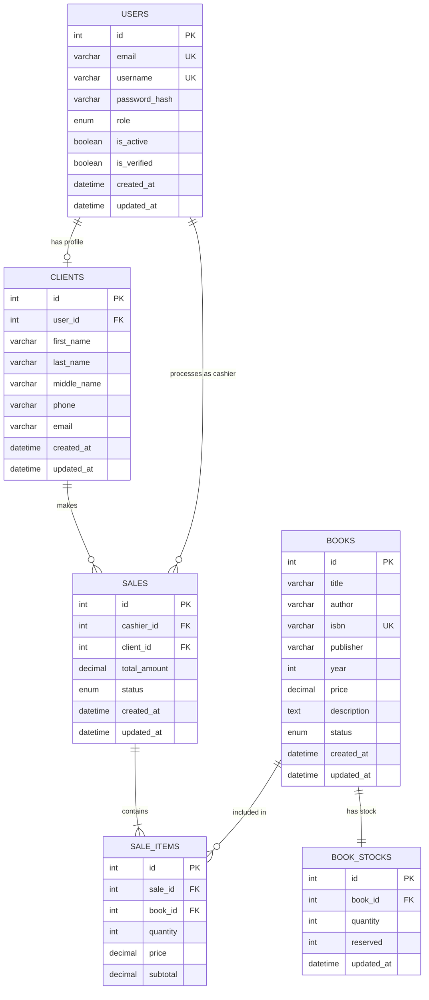

# 📚 Книжный магазин API

Flask-приложение для управления книжным магазином с системой аутентификации, управления продажами и AI-рекомендациями.

## 🔧 Технологии

- **Backend:** Python 3, Flask
- **База данных:** SQLite (по умолчанию), PostgreSQL (опционально)
- **Аутентификация:** JWT (JSON Web Tokens)
- **Документация:** Swagger/OpenAPI
- **AI модуль:** Система рекомендаций книг

## 🚀 Быстрый старт

### 1. Клонирование и установка

```bash
cd "/path/to/course work"
python3 -m venv venv
source venv/bin/activate  # macOS/Linux
# или
venv\Scripts\activate  # Windows

pip install -r requirements.txt
```

### 2. Настройка переменных окружения

```bash
cp .env.example .env
```

Отредактируйте `.env` при необходимости.

### 3. Запуск приложения

```bash
python main.py
```

Приложение доступно по адресу: `http://localhost:5001`

### 4. Swagger документация

Откройте в браузере: `http://localhost:5001/swagger/`

---

## 📖 Основное

### Регистрация администратора

```bash
POST http://localhost:5001/api/auth/register
Content-Type: application/json

{
  "email": "<ADMIN_EMAIL>",
  "username": "admin",
  "password": "<ADMIN_PASSWORD>",
  "role": "admin"
}
```

### Вход в систему

```bash
POST http://localhost:5001/api/auth/login
Content-Type: application/json

{
  "email": "<ADMIN_EMAIL>",
  "password": "<ADMIN_PASSWORD>"
}
```

Ответ:
```json
{
  "access_token": "eyJhbGciOiJIUzI1NiIsInR5cCI6IkpXVCJ9...",
  "refresh_token": "eyJhbGciOiJIUzI1NiIsInR5cCI6IkpXVCJ9...",
  "message": "Вход выполнен успешно"
}
```

Для локальных тестовых учетных записей используйте переменные окружения из `.env.example`
и скрипт `init_test_users.py`. Пароли не должны храниться в README или исходном коде.

---

## 📡 API Endpoints

### Authentication (`/api/auth`)

| Метод | Endpoint | Описание | Доступ |
|-------|----------|----------|--------|
| POST | `/register` | Регистрация | Все |
| POST | `/login` | Вход | Все |
| POST | `/refresh` | Обновление токена | Все |
| GET | `/me` | Данные пользователя | Авторизованные |
| POST | `/logout` | Выход | Авторизованные |

### Books (`/api/books`)

| Метод | Endpoint | Описание | Доступ |
|-------|----------|----------|--------|
| GET | `` | Список книг | Все |
| GET | `/search?q=...` | Поиск книг | Все |
| GET | `/{id}` | Данные книги | Все |
| POST | `` | Создать книгу | Менеджер, Админ |
| PUT | `/{id}` | Обновить книгу | Менеджер, Админ |
| POST | `/{id}/archive` | Архивировать | Админ |
| POST | `/{id}/restore` | Восстановить | Админ |

### Stock (`/api/books/{id}/stock`)

| Метод | Endpoint | Описание | Доступ |
|-------|----------|----------|--------|
| GET | `` | Остатки книги | Все |
| PUT | `` | Обновить остатки | Менеджер, Админ |
| POST | `/adjust` | Корректировка | Менеджер, Админ |

### Sales (`/api/sales`)

| Метод | Endpoint | Описание | Доступ |
|-------|----------|----------|--------|
| POST | `` | Оформить продажу | Кассир, Менеджер, Админ |
| GET | `` | Список продаж | Менеджер, Админ |
| GET | `/{id}` | Данные продажи | Кассир, Менеджер, Админ |
| POST | `/{id}/return` | Возврат | Кассир, Менеджер, Админ |
| POST | `/{id}/cancel` | Отмена | Менеджер, Админ |

### Clients (`/api/clients`)

| Метод | Endpoint | Описание | Доступ |
|-------|----------|----------|--------|
| GET | `` | Список клиентов | Кассир, Менеджер, Админ |
| POST | `` | Создать клиента | Кассир, Менеджер, Админ |
| GET | `/me` | Мой профиль | Все авторизованные |
| PUT | `/me` | Обновить профиль | Все авторизованные |
| GET | `/{id}` | Данные клиента | Кассир, Менеджер, Админ |
| PUT | `/{id}` | Обновить клиента | Менеджер, Админ |
| DELETE | `/{id}` | Удалить клиента | Менеджер, Админ |

### Users (`/api/users`) — Только администратор

| Метод | Endpoint | Описание | Доступ |
|-------|----------|----------|--------|
| GET | `` | Список пользователей | Админ |
| GET | `/{id}` | Данные пользователя | Админ |
| PUT | `/{id}/role` | Изменить роль | Админ |
| POST | `/{id}/deactivate` | Деактивировать | Админ |
| POST | `/{id}/activate` | Активировать | Админ |
| DELETE | `/{id}` | Удалить | Админ |

### Reports (`/api/reports`)

| Метод | Endpoint | Описание | Доступ |
|-------|----------|----------|--------|
| GET | `/sales` | Отчёт по продажам | Менеджер, Админ |
| GET | `/sales/top-books` | Топ книг | Менеджер, Админ |
| GET | `/stock` | Отчёт по остаткам | Менеджер, Админ |
| GET | `/cashier/{id}` | Отчёт по кассиру | Менеджер, Админ |

### Recommendations (`/api/recommendations`) — AI

| Метод | Endpoint | Описание | Доступ |
|-------|----------|----------|--------|
| POST | `/cart` | Рекомендации для корзины | Все |
| GET | `/history` | По истории покупок | Все авторизованные |
| GET | `/personal` | Персональные | Все авторизованные |
| POST | `/sets` | Дополнить комплект | Все |
| GET | `/popular` | Популярные книги | Все |

---

## 🤖 AI Рекомендации

### Как работает:

1. **Анализ корзины** — анализирует жанры, авторов, ценовую категорию
2. **История покупок** — учитывает предыдущие покупки клиента
3. **Комплекты** — предлагает книги из тех же серий

### Пример использования:

```bash
# Рекомендации для корзины
POST http://localhost:5001/api/recommendations/cart
Authorization: Bearer <token>
Content-Type: application/json

{
  "cart_book_ids": [1, 3, 5],
  "limit": 5
}

# Персональные рекомендации
GET http://localhost:5001/api/recommendations/personal?limit=5&cart_book_ids=1,2,3
Authorization: Bearer <token>
```

---

## 🗄️ База данных

### ERD Диаграмма



---

## 📁 Структура проекта

```
course work/
├── ai_module/              # AI модуль рекомендаций
│   ├── __init__.py
│   └── recommender.py
├── app/
│   ├── __init__.py         # Фабрика приложения
│   ├── decorators.py       # Декораторы ролей
│   ├── extensions.py       # Расширения Flask
│   ├── models/             # Модели базы данных
│   │   ├── user.py
│   │   └── store.py
│   ├── routes/             # API роуты
│   │   ├── auth_routes.py
│   │   ├── book_routes.py
│   │   ├── sale_routes.py
│   │   ├── client_routes.py
│   │   ├── user_routes.py
│   │   ├── report_routes.py
│   │   └── recommendation_routes.py
│   ├── services/           # Бизнес-логика
│   │   ├── auth_service.py
│   │   ├── store_service.py
│   │   └── recommendation_service.py
│   └── schemas/            # Marshmallow схемы
├── instance/               # База данных SQLite
├── config.py               # Конфигурация
├── main.py                 # Точка входа
├── requirements.txt        # Зависимости
└── .env.example            # Пример переменных окружения
```

---

## 🔐 Роли пользователей

| Роль | Описание |
|------|----------|
| `admin` | Полный доступ ко всем функциям |
| `manager` | Управление книгами, остатками, продажами, отчётами |
| `cashier` | Продажи, возвраты, просмотр каталога |
| `client` | Покупатель (просмотр, редактирование профиля) |

---

## 📦 Docker

```bash
# Сборка
docker-compose build

# Запуск
docker-compose up -d

# Остановка
docker-compose down
```

---
